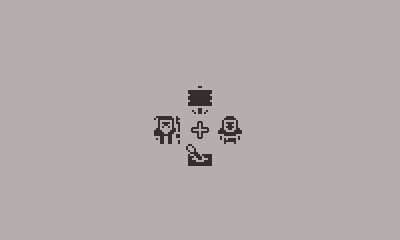

#  pdDialogue

a Playdate dialogue system



## Installation

To install, copy the `pdDialogue.lua` file into your project and import it with `import "path/to/pdDialogue"`. Alternatively, you can use [toybox.py](https://didier.malenfant.net/toybox.py/):

```bash
toybox add https://github.com/PizzaFuel/pdDialogue
toybox update
```

## Getting Started

If you don't need any styles, it's *very* easy to get started. The library comes with some defaults to get working out of the box:

```lua
import "CoreLibs/object"
import "CoreLibs/graphics"

import "pdDialogue"

pdDialogue.say("Hello, World!")

function playdate.update()
    pdDialogue.update()
end
```

The [Examples folder](https://github.com/PizzaFuel/pdDialogue/tree/main/Examples) has more code samples for styles or sprite usage, and you can check out the [wiki](https://github.com/PizzaFuel/pdDialogue/wiki) for more in-depth documentation :)

Example image assets are from [Kenney's 1-Bit Pack](https://www.kenney.nl/Examples/assets/bit-pack) and the demo fonts are included in the [Playdate SDK](https://play.date/dev/)!
